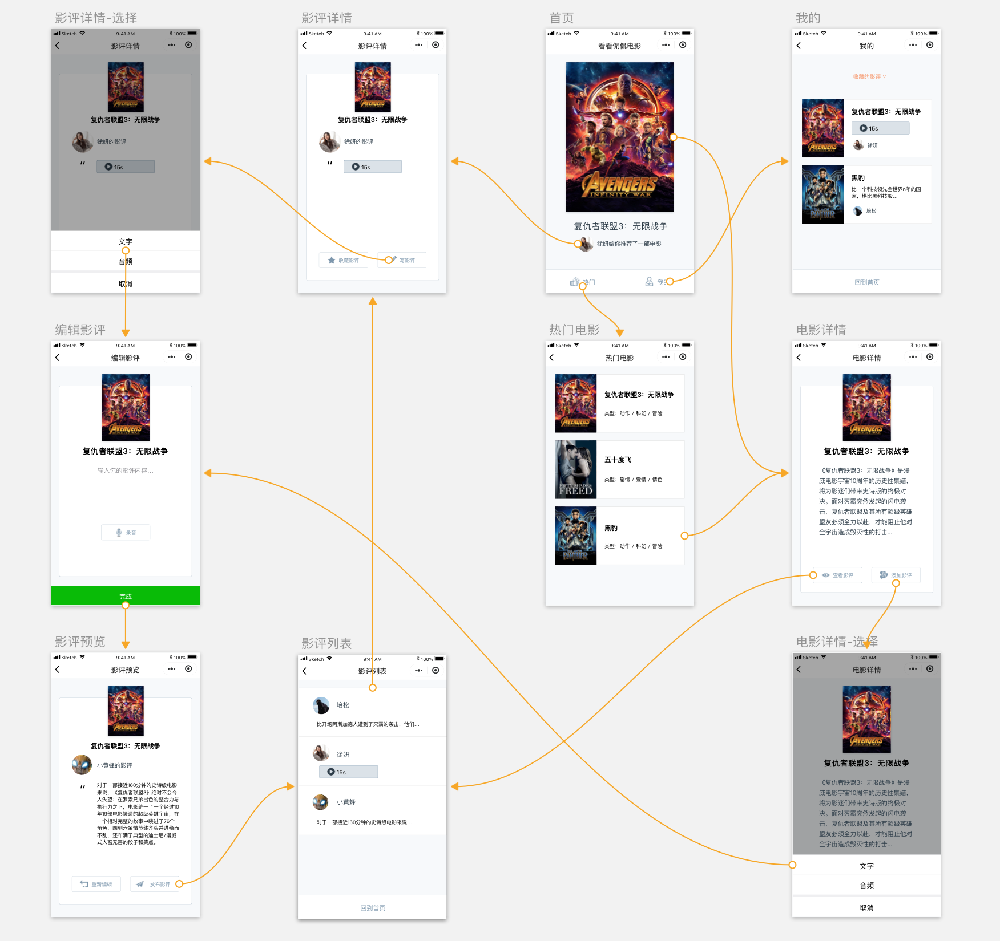

# 侃影评

侃影评是一个电影影评小程序，该项目允许用户对时下最热门的电影撰写影评。除此之外，用户还可收藏并分享电影影评。

当前分支是基于**腾讯云服务**进行后端开发的，[master分支](https://github.com/fujianlian/movie)是基于**小程序云开发**进行后端开发的，[mpvue分支](https://github.com/fujianlian/movie/tree/mpvue)也是采用**云开发**进行后端开发的，不过代码编写采用了[mpvue](http://mpvue.com/)

相对于**腾讯云服务**模式，**云开发**相比来说比较简单，建议选择**云开发**模式开发

## 目录

- [UI交互图](#UI交互图)

- [实现页面列表](#实现页面列表)

- [项目运行](#项目运行)

- [贡献](#贡献)

## UI交互图

点击[此处](https://s3.cn-north-1.amazonaws.com.cn/static-documents/nd666/%E7%9C%8B%E7%9C%8B%E4%BE%83%E4%BE%83%E7%94%B5%E5%BD%B1%E8%B5%84%E6%BA%90/%E4%BA%A4%E4%BA%92%E5%9B%BE2.png)在新标签页打开大图

## 实现页面列表

* 首页：随机展示当前热门电影的某一条影评。
* 电影列表页：展示当前最热门的若干部电影（至少5部）。
* 电影详情页：展示电影详情信息。
* 影评列表页：展示某电影的影评列表。
* 影评详情页：展示某条具体的影评内容。
* 影评编辑页：用户能在此页面编辑自己的影评内容。
* 影评预览页：预览已编辑完成的影评。
* 个人中心页：展示用户已收藏和已发布的影评列表。

## 项目运行

项目运行可以[参考](https://github.com/fujianlian/mall/blob/tencent-cloud/README.md)这篇文章

**注意：** server/config.js中的相关配置需要替换成自己申请的；sql文件和图片在sql&images文件夹下，记得替换data.sql中的**IMAGE_BASE_URL**值

## 贡献

* 如果你在使用过程中遇到问题，欢迎给我提Issue

* 如果你有好的想法，欢迎pull request

* 觉得不错的话，顺手 **点个Star**，笔者需要您的支持
